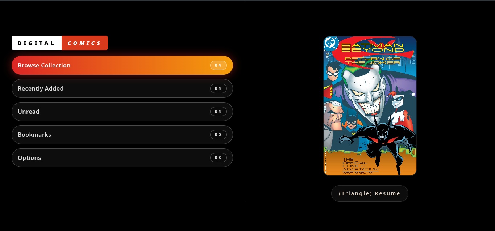
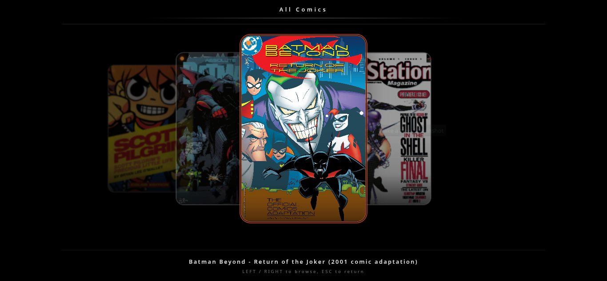
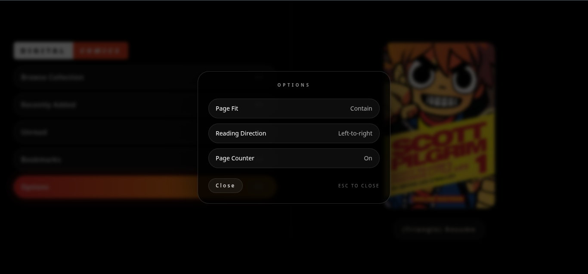

# PSP Digital Comics

A faithful recreation of the classic PSP Digital Comics reader, rebuilt for modern web, desktop, and mobile platforms. Browse your comic collection in a 3D carousel, read with customizable options, and pick up right where you left off — all while bringing your own CBZ files.

## Screenshots

### Start Screen


The main menu with navigation options including Browse Collection, Recently Added, Unread, Bookmarks, and Options.

### Comic Carousel


Browse your collection in a 3D carousel view. Navigate left/right to select comics.

### Reader Options


Customize reading experience with settings for page fit, reading direction, and page counter.

## Features

- **PSP-Accurate UI** — Faithful recreation of the original PSP Digital Comics interface with authentic styling and navigation patterns
- **3D Comic Carousel** — Browse your collection in an interactive 3D carousel with smooth transitions
- **CBZ Support** — Open standard CBZ comic book archive files (users supply their own comics)
- **Customizable Reader** — Configure page fit mode (contain/cover), reading direction (LTR/RTL), and page counter visibility
- **Spread Mode** — Automatic two-page spread display on wide screens for an immersive reading experience
- **Zoom & Pan** — Pinch or drag to zoom in/out and pan around pages in the reader
- **Bookmark System** — Bookmark comics with position saving so you can resume exactly where you left off
- **Read/Unread Tracking** — Automatically tracks which comics have been read, with dedicated Unread view
- **Collection Views** — Filter your library by All, Recently Added, Unread, or Bookmarked
- **Persistent Settings** — All preferences, bookmarks, and reading progress saved to localStorage
- **WebGL Background** — Dynamic shader-based animated background for visual flair
- **Responsive Design** — Scales gracefully across desktop, tablet, and mobile viewports

## Quick Start

Install dependencies:

```bash
npm install
```

Run dev server:

```bash
npm run dev
```

Build for production:

```bash
npm run build
```

Preview the production build:

```bash
npm run preview
```

## Tech Stack

- **Frontend:** React 19 + TypeScript
- **Build Tool:** Vite 6
- **Styling:** Tailwind CSS 3
- **CBZ Handling:** JSZip for archive extraction
- **Graphics:** WebGL shaders for animated background

## PWA Support

A `manifest.json` and service worker are included in `public/`. For full offline support and advanced caching, consider integrating `vite-plugin-pwa` or Workbox.

## Packaging

- **Desktop:** Wails is recommended for native desktop builds. Create a Wails project and point the frontend at this `dist/` build.
- **Android/iOS:** Use Capacitor to wrap the web build into a native mobile app (APK/IPA).

## License

MIT — see [LICENSE](LICENSE).

## Notes

Do not distribute copyrighted comics with the release. The app expects users to supply their own CBZ files.